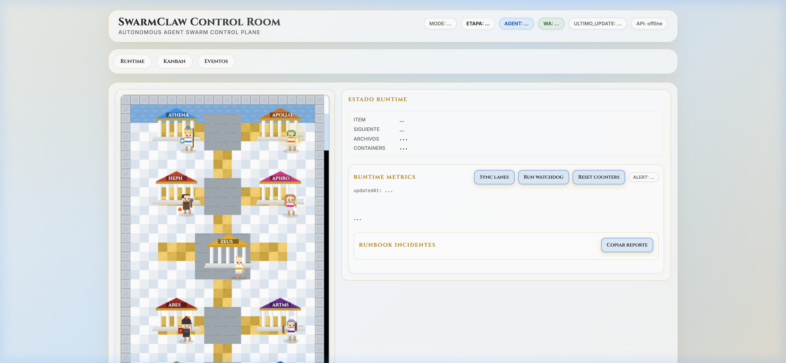

<p align="center">
  
</p>

<h1 align="center">🏛️ SwarmDash</h1>

<p align="center">
  <strong>AI Agent Orchestration Dashboard</strong><br>
  <em>Control your autonomous agent swarm with circuit breakers, Kanban, and SLO monitoring.</em>
</p>

<p align="center">
  <a href="https://opensource.org/licenses/MIT"></a>
  <a href="https://github.com/juancruzmunozalbelo/swarmdash/stargazers"></a>
  
  
</p>

---

## ✨ What is SwarmDash?

**SwarmDash** is a real-time control panel for managing autonomous AI agent swarms. Built with the "Gods of Olympus" theme, it provides visual monitoring of agent status, task progress, error recovery, and system health — all in a single-page dashboard with zero dependencies.

### Key Capabilities

- **Agent Visualization** — Pixel-art map of your agent swarm with real-time status
- **Circuit Breakers** — Visual indicators showing agent health (closed/open/half-open)
- **Kanban Board** — Task tracking across Backlog, WIP, and Done lanes
- **Runtime Metrics** — SLO monitoring, error budgets, and performance counters
- **Incident Runbook** — Track and manage incidents with one-click report copy
- **Host Events** — Real-time event stream from your infrastructure

## 🎮 Features

| Feature | Description |
|---|---|
| 🏛️ **Olympus Theme** | Custom pixel-art gods representing each agent |
| 🔄 **Circuit Breakers** | Visual health status for each service |
| 📋 **Kanban Board** | Drag-and-track task management |
| 📊 **Runtime Metrics** | Counters, SLOs, and error budgets |
| 🚨 **Alert System** | Themed modal alerts with severity levels |
| 📝 **Incident Runbook** | Log and export incident reports |
| 🔗 **API Integration** | Polls `/api/state` for real-time updates |
| 🎯 **Zero Dependencies** | Pure HTML/CSS/JS — no build step needed |

## 🛠️ Tech Stack

- **Frontend:** Vanilla HTML, CSS, JavaScript
- **Styling:** Custom Olympus theme with Cinzel + Inter fonts
- **Pixel Art:** Custom agent sprites
- **API:** REST polling (`/api/state`, `/api/metrics`)
- **Build:** None — open `index.html` and go

## ⚡ Quick Start

```bash
# Clone
git clone https://github.com/juancruzmunozalbelo/swarmdash.git
cd swarmdash

# Serve (any static server works)
python3 -m http.server 8888

# Open http://localhost:8888
```

### Connect to your backend

SwarmDash polls these endpoints:

| Endpoint | Method | Description |
|---|---|---|
| `/api/state` | GET | Full swarm state (agents, tasks, metrics) |
| `/api/metrics` | GET | Runtime counters and SLOs |
| `/api/kanban/sync` | POST | Sync Kanban lanes |
| `/api/watchdog` | POST | Trigger watchdog check |

## 📁 Project Structure

```
swarmdash/
├── index.html      # Main dashboard page
├── style.css       # Olympus theme styles
├── app.js          # Dashboard logic, API polling, Kanban
├── docs/
│   └── screenshot.png
├── LICENSE
├── CONTRIBUTING.md
└── README.md
```

## 🤝 Contributing

Contributions are welcome! See [CONTRIBUTING.md](CONTRIBUTING.md) for guidelines.

## 📄 License

MIT License — see [LICENSE](LICENSE).

## 👤 Author

**Juan Cruz Muñoz Albelo**
- GitHub: [@juancruzmunozalbelo](https://github.com/juancruzmunozalbelo)
- LinkedIn: [juan-cruz-albelo-](https://linkedin.com/in/juan-cruz-albelo-/)

---

<p align="center">
  Made with ❤️ and ⚡ from Mount Olympus
</p>
